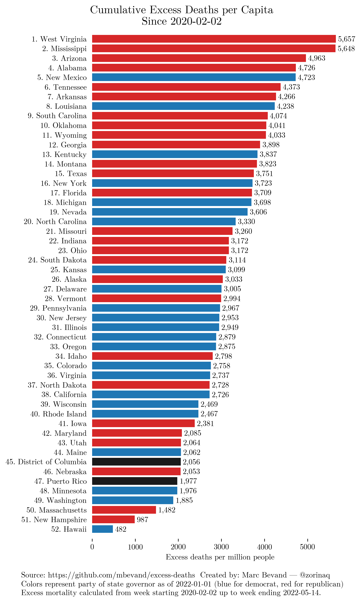
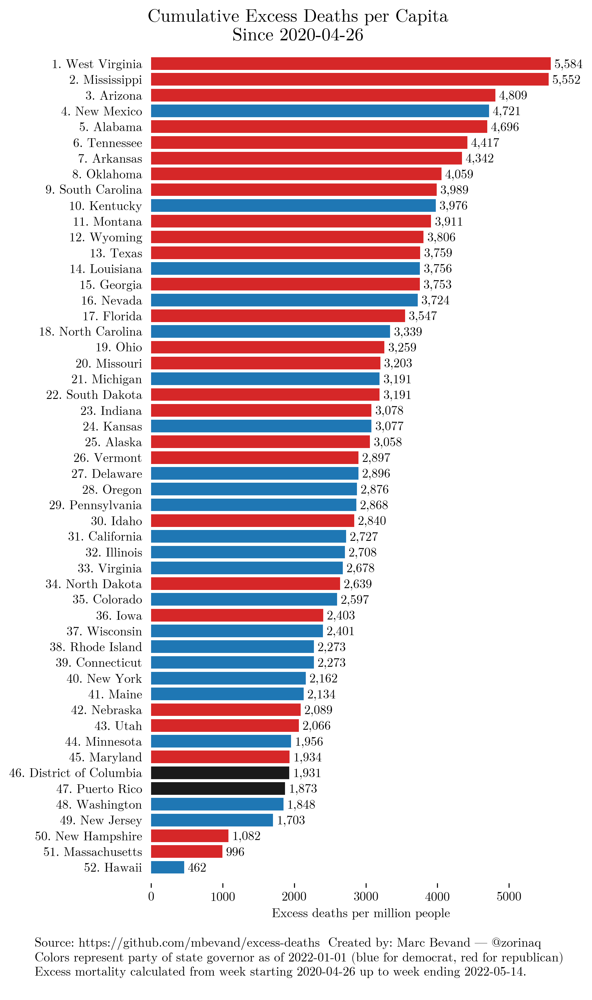
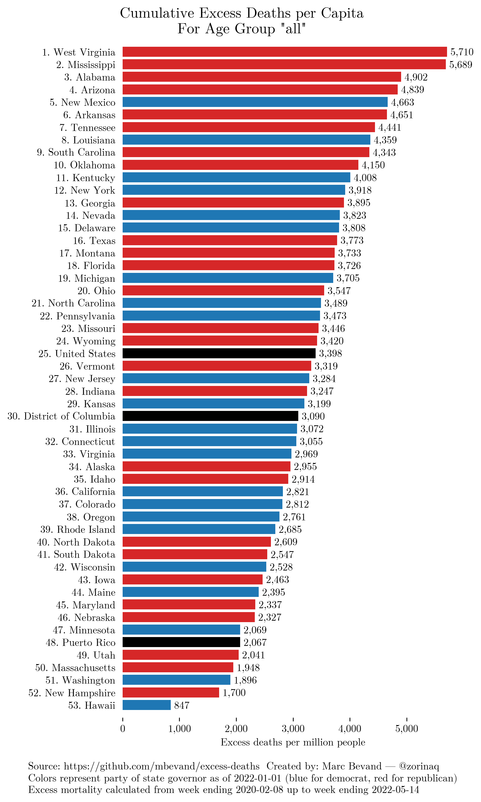

*Updated: 09 Mar 2022*

Author: Marc Bevand

This repository charts cumulative excess deaths per capita for each US state,
during the COVID-19 pandemic. This is the first analysis that we know of that
presents excess deaths broken down by age group. We present two sets of charts:

1. Overall excess deaths, based on the US CDC's estimate of excess deaths
  (source code: [all_ages.py](all_ages.py))
2. Excess deaths by age group, based on our own model of expected deaths per
  age group (source code: [by_age_group.py](by_age_group.py))

## Overall excess deaths

### Excess deaths since 2020-02-02

### Excess deaths since 2020-04-26 ("long-term excess")

Long-term excess deaths are defined as excess deaths after 2020-04-26 (roughly
the peak of deaths of the first wave in Spring 2020). Long-term excess deaths are an
indirect result of each state's long-term plan and interventions against the
pandemic:

## Excess deaths by age group

The charts below are based on our own analysis that models expected deaths by
age group.

**Raw numerical output of our model: [by_age_group.csv](by_age_group.csv)**

As this CSV shows, our model produces figures close to the CDC. As of week ending
2022-02-26, the CDC estimates 1,088,800 excess deaths, while our model estimates 1,075,709,
a difference of only -1.20%. Our model tends to produce excess death estimates slightly
below the CDC's estimates because their model ignores deficits of deaths (["Negative
values, where the observed count fell below the thresholds, were set to
zero"](https://www.cdc.gov/nchs/nvss/vsrr/covid19/excess_deaths.htm)).

### Ages 85+

### Ages 75-84

### Ages 65-74

### Ages 45-64

### Ages 25-44

### Ages under 25

### All ages

## Methodology

### For all_ages.py

We take [deaths reported by the US CDC, per state, per
week](https://data.cdc.gov/NCHS/Excess-Deaths-Associated-with-COVID-19/xkkf-xrst/)
(column "Observed Number" where "Type" is "Predicted (weighted)"). The US
CDC weighted these figures to account for reporting delays. This
affects only data from the last few weeks. In our experience, weighted vs
unweighted has little impact on the charts above.

For each week we calculate the difference between reported
deaths and the average expected number of deaths from the US CDC (column
"Average Expected Count"). The difference can be positive or negative.

We add up these differences to calculate the final cumulative excess deaths
per capita.

We use states population from the [US
Census Bureau 2019 estimates](https://www2.census.gov/programs-surveys/popest/datasets/2010-2019/state/detail/SCPRC-EST2019-18+POP-RES.csv).

### For by_age_group.py

We analyze the [weekly count of deaths by state and by age
group](https://data.cdc.gov/NCHS/Weekly-Counts-of-Deaths-by-Jurisdiction-and-Age/y5bj-9g5w).
This dataset contains data beginning on the week ending 2015-01-10.
For each state, for each age group, for each week of the pandemic, we
calculate expected deaths by modeling both **seasonal variation** and
**year-to-year trends**: we gather deaths that occured on that week of the year
during the years preceding the pandemic, then we perform a linear regression to
project expected deaths in the future.

We adopt the same convention as the CDC: we assume the pandemic starts on year
2020, MMWR week 6 (which starts on 2020-02-02).

The per capita figures need detailed population information by state by age group,
which we obtained from the [US Census Bureau 2020
estimates](https://www.census.gov/programs-surveys/popest/technical-documentation/research/evaluation-estimates/2020-evaluation-estimates/2010s-state-detail.html),
file [Single Year of Age and Sex for the Civilian
Population](https://www2.census.gov/programs-surveys/popest/datasets/2010-2020/state/asrh/SC-EST2020-AGESEX-CIV.csv)

## TODO

Compare excess deaths by age group with [COVID deaths by age
group](https://data.cdc.gov/NCHS/Provisional-COVID-19-Deaths-by-Sex-and-Age/9bhg-hcku)
to determine which age groups likely have the most underreported COVID deaths.
